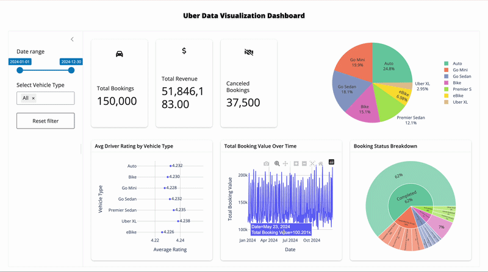

# DSCI-532_2026_32: Uber Dashboard Project
This project develops an interactive dashboard analyzing Uber’s 2024 ride data to evaluate operational performance, revenue trends, and customer satisfaction. The dashboard provides key business insights through visual analytics, helping stakeholders understand ride volume patterns, vehicle type performance, geographic demand distribution, trip duration trends, and customer ratings.

Using Python, Shiny, and interactive visualizations, the project transforms raw ride-level data into meaningful KPIs and decision-support tools. The dashboard enables users to explore trends over time, compare service categories, and identify areas for operational improvement and revenue optimization.

This project demonstrates the full data workflow: data cleaning, exploratory data analysis (EDA), KPI development, and interactive dashboard deployment. It emphasizes business storytelling, data-driven decision-making, and clear visual communication.

## Installations

1.  Fork the repository: https://github.com/UBC-MDS/DSCI-532_2026_32_Uber_dashboard.git

2.  Clone the fork locally using:

``` bash
git clone git@github.com:UBC-MDS/DSCI-532_2026_32_Uber_dashboard.git
```
Then please cd into the root of the repo by:
```bash
cd DSCI-532_2026_32_Uber_dashboard
```

3.  Create the virtual environment with:

``` bash
conda env create -f environment.yml
```

4.  Once the environment is created, activate it with:

``` bash
conda activate dsci-532_2026_32_Uber_dashboard
```

5.  Run the app locally with:

``` bash
shiny run src/app.py 
```
This will start the Shiny app, and you can access it in your web browser. The dashboard will allow you to explore Uber's 2024 ride data through interactive visualizations and KPIs. If you'd like to contribute check out: https://github.com/UBC-MDS/DSCI-532_2026_32_Uber_dashboard/blob/dev/CONTRIBUTING.md
## Deployment
The dashboard is deployed on posit cloud, and the preview build version can be accessed at the following URL: https://019cca41-6593-d698-f198-826bf5222992.share.connect.posit.cloud/ .The stable build version can be accessed at the following URL: https://019cca3c-2682-2efd-8947-1fd5caf109bc.share.connect.posit.cloud/ . This allows users to interact with the dashboard without needing to run it locally, providing easy access to the insights derived from Uber's 2024 ride data.


## Demo



