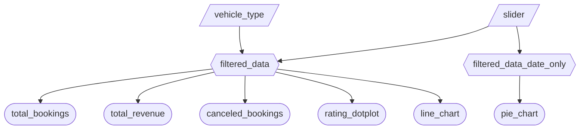

# App Specification

## Section 1: Updated Job Stories

| #   | Job Story                       | Status         | Notes                         |
| --- | ------------------------------- | -------------- | ----------------------------- |
| 1   | When James reports the overview of the Uber operation to the CEO, he wants to know the number of total bookings, total revenue, and cancelled bookings, so he can paint the picture of how well the business is doing. | ✅ Implemented | Newly added job story | 
| 2   | When James is evaluating the cost-effectiveness of each vehicle type, he wants to visualize the breakdown of the revenue generated by each vehicle type, so he can better identify which categories drive the most revenue. | ✅ Implemented |  Pie chart reflects date filter only (not vehicle filter).                            |
| 3   | When James analyzes booking cancellations, he wants to see canceled bookings within the selected filters so he can assess operational inefficiencies such that he can improve conversion from booking to rides. | ✅ Implemented |  Uses  filtered dataset.  |
| 4   | When James evaluates seasonality and booking trends, he wants to visualize total booking value over time so he can identify seasonal demand patterns. | ✅ Implemented  |  Line chart reflects both date and vehicle filters.  |
| 5   | When James evaluates service quality across vehicle categories, he wants to compare average driver ratings by vehicle type so he can monitor customer satisfaction trends. | ✅ Implemented  |  New job story added for driver rating dot plot. |

## Section 2: Component Inventory

| ID            | Type          | Shiny widget / renderer | Depends on                   | Job story  |
| ------------- | ------------- | ----------------------- | ---------------------------- | ---------- |
| `slider`      | Input         | `ui.input_slider()`     | —                            | #1, #2, #3, #4 |
| `vehicle_type`| Input         | `ui.input_selectize()`  | -                            | #1, #3, #4, #5 |
| `action_button`  | Input      | `ui.input_action_button()` |  -                        | All        |
| `filtered_data` | Reactive calc | `@reactive.calc`      | `slider`, `vehicle_type`     | #1, #3, #4, #5 |
| `filtered_data_date_only` | Reactive calc | `@reactive.calc` | `slider`                | #2 |
| `total_bookings` |	Output	  | `@render.text`          | 	`filtered_data`	           | #1 |
| `total_revenue`  |	Output	  | `@render.text`          | 	`filtered_data`	           | #1 |
| `canceled_bookings` |	Output	| `@render.text` 	        |   `filtered_data`            | #3 |
| `rating_dotplot` |	Output	  | `@render_plotly`        |  	`filtered_data`        	   | #5 |
| `line_chart`  |	Output	      | `@render_plotly`        | 	`filtered_data`	           | #4 |
| `pie_chart`   |	Output	      | `@render_plotly`        |   `filtered_data_date_only`	 | #2 |

## Section 3: Reactivity Diagram

## Section 4: Calculation Details

1) The `@reactive.calc` element `filtered_data` depends on slider (date range) and vehicle_type (selected vehicle types). It performs the following transfromation:
It filters rows to the selected date range, and if vehicle types are selected and do not include "All", filters rows to selected vehicle categories. 
The filtered DataFrame is then used across most dashboard components with the following outputs consuming it: `total_bookings`, `total_revenue`, `canceled_bookings`, 
`rating_dotplot`,`line_chart`.

2) The `@reactive.calc` element `filtered_data_date_only` only depends on the slider (date range). It performs the following transfromation:
filters rows to the selected date range. The filtered DataFrame is then used to create a pie chart showcasing split of revenue across vehicle types with the only output consuming it 
being `pie_chart`.

  
  